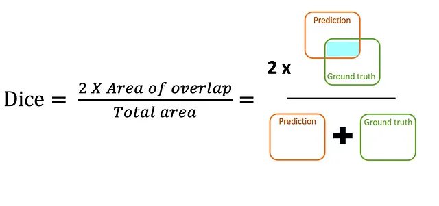

# SKIN CANCER SEGMENTATION


The aim of this project is to train segmentation models with png mask. This work uses [UNet model](https://arxiv.org/pdf/1505.04597) specialized in biomedical image segmentation in order to segment skin cancers. I used the dataset [Skin cancer: HAM10000](https://www.kaggle.com/datasets/surajghuwalewala/ham1000-segmentation-and-classification/data), a easy download version of [The HAM10000 dataset, a large collection of multi-source dermatoscopic images of common pigmented skin lesions](https://doi.org/10.7910/DVN/DBW86T) and trained the model. The dataset used consists of .jpg images and .png binary masks.


## U-Net Architecture

The U-Net architecture achieves very good performance on very different biomedical segmentation applications. U-net architecture (example for 32x32 pixels in the lowest resolution) as presented in Figure 1. Each blue box corresponds to a multi-channel feature map. The number of channels is denoted on top of the box. The x-y-size is provided at the lower left edge of the box. White boxes represent copied feature maps. The arrows denote the different operations. This work is based on [Ronneberger et al](https://arxiv.org/pdf/1505.04597).


Figure 1


## HOW TO INSTALL
```sh
conda create -n torch python==3.9
conda activate torch

git clone https://github.com/nata-vito/skin-cancer-segmentation.git
cd skin-cancer-segmentation
pip install -r requirement.txt
```

You can find the notebook in ```./notebooks/UNet_skin_cancer_seg.ipynb``` and the model [here](https://huggingface.co/natavito/skin_cancer_seg/blob/main/README.md).

## COMPARING MODELS
The second version of the model has improved compared to the first, as can be seen in the image below. The two models are submitted to the same image for inference, and the following table shows the results of the inference.

The metric used to evaluate the model was the DICE score.

DICE score = 2 * |A ∩ B| / (|A| + |B|)

Dice score = 2 * (number of common elements) / (number of elements in set A + number of elements in set B

[Dice Coefficient! What is it?](https://medium.com/@lathashreeh/dice-coefficient-what-is-it-ff090ec97bda)



### Inference Results

**skin_cancer_v1.pth**


**skin_cancer_v2.pth**


| Model | Image | DICE Coeficient |
| ------------- | ------------- | ------------- |
| skin_cancer_v1.pth | ISIC_0033463.jpg | 0.95799 |
| skin_cancer_v1.pth | ISIC_0026023.jpg | 0.79981 |
| **skin_cancer_v1.pth** | ISIC_0029811.jpg | **0.79044** |
| **skin_cancer_v1.pth** | ISIC_0029382.jpg | **0.90416** |
| skin_cancer_v1.pth | ISIC_0032059.jpg | 0.80779 |

| Model | Image | DICE Coeficient |
------------- | ------------- | ------------- |
| **skin_cancer_v2.pth** | ISIC_0033463.jpg | **0.96696** |
| **skin_cancer_v2.pth** | ISIC_0026023.jpg | **0.89177** |
| skin_cancer_v2.pth | ISIC_0029811.jpg | 0.74671 |
| skin_cancer_v2.pth | ISIC_0029382.jpg | 0.85114 |
| **skin_cancer_v2.pth** | ISIC_0032059.jpg | **0.87269** |


### Test Loss and Test DICE
| Model | Test Loss | Test DICE |
| ------------- | ------------- | ------------- |
| skin_cancer_v1.pth | 0.13627266608888194 | 0.9029648516859327 |
| skin_cancer_v2.pth | 0.13620347219208875 | 0.9024439165516506 |

### Training Validation Results
By analyzing the loss and DICE graphs, we can see that from epoch 12 to 20, the model didn't learn much, but there was a small improvement in the coefficients.


### Conclusion
It can be concluded that both models meet the objective, but version two obtained better results than the first version. This result was due to the number of training epochs, for version two there were 20 and for the first only 10.

### Next Steps
The next steps are: 
- Finding the best parameters for training the model
- Increase the number of training epochs
  
## 🤝 Collaborators

We would like to thank the following people who contributed to this project:

<table>
  <tr>
    <td align="center">
      <a href="#">
        <br>
        <sub>
          <b>Natanael Vitorino</b>
        </sub>
      </a>
    </td>
  </tr>
</table>


## 📝 License

This project is under license. See the file [LICENSE](LICENSE) for more details.

---
